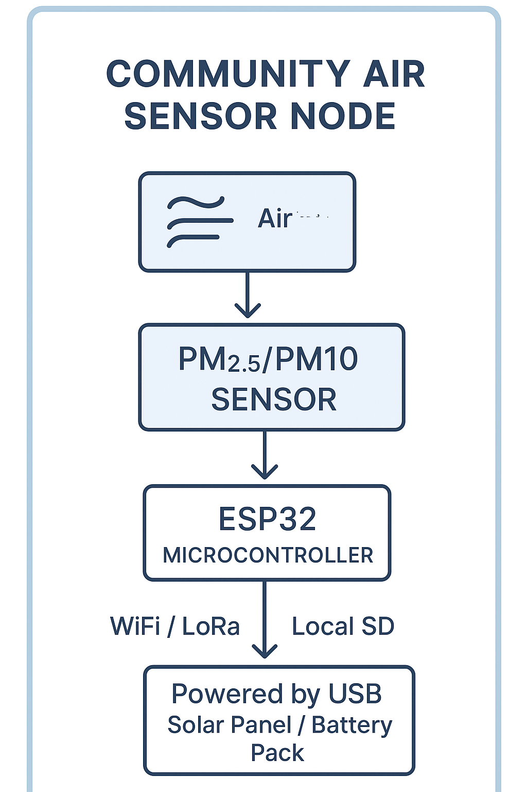
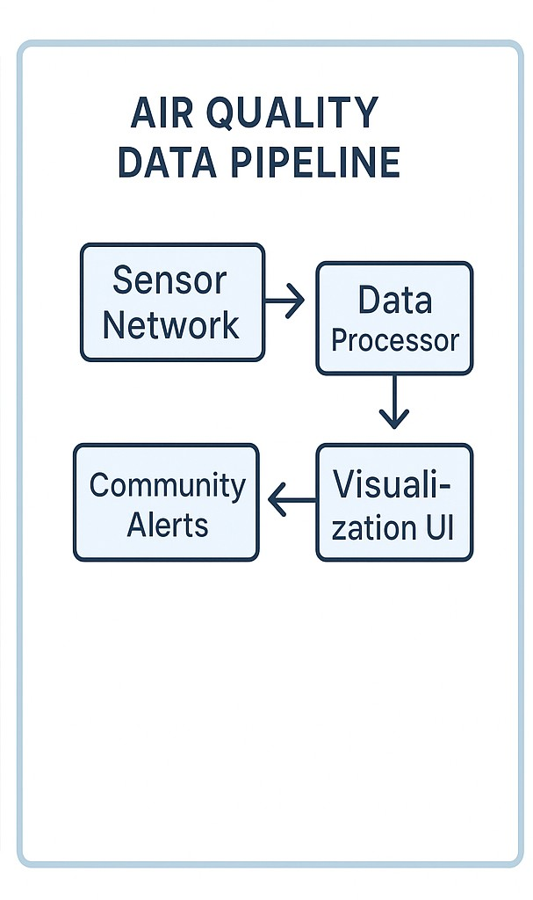
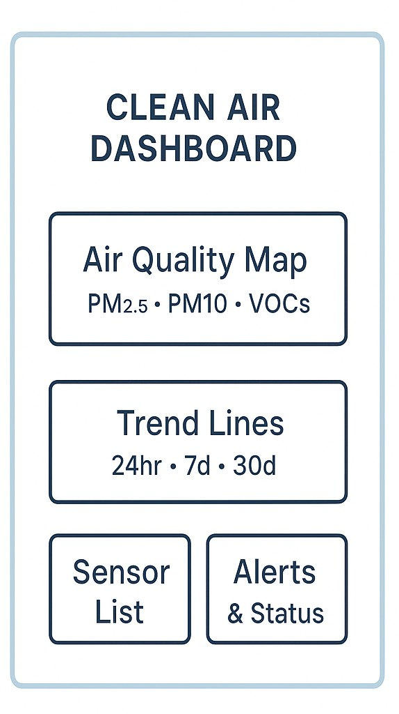

📘 Schematic 1 — Low-Cost Community Air Sensor Node

+------------------------------------------------------+
|              COMMUNITY AIR SENSOR NODE               |
+------------------------------------------------------+
|  [Air Intake] --> [PM2.5/PM10 Sensor] --->           |
|                     |                                |
|                     v                                |
|            [VOC / NO2 / CO Sensor]                   |
|                     |                                |
|                     v                                |
|               [ESP32 Microcontroller]                |
|                     |                                |
|         +-----------+------------+                   |
|         |                        |                   |
|   [WiFi / LoRa]              [Local SD]              |
|         |                        |                   |
|         v                        v                   |
|    Upload to API         Offline Data Backup         |
+------------------------------------------------------+
|  Powered by USB / Solar Panel / Battery Pack         |
+------------------------------------------------------+

📘 Schematic 2 — Air Quality Data Pipeline

+------------------+     +------------------+     +------------------+
|  Sensor Network  | --> |  Gateway / API   | --> |  Data Processor   |
+------------------+     +------------------+     +------------------+
        |                        |                         |
        |                        v                         v
        |                  Store JSON                Analyze / Validate
        |                                                |
        v                                                v
+------------------+                             +------------------+
| Community Alerts | <-- Threshold Logic -------- | Visualization UI |
+------------------+                             +------------------+

📘 Schematic 3 — Public Dashboard Layout

+--------------------------------------------------------------+
|                       CLEAN AIR DASHBOARD                    |
+--------------------------------------------------------------+
| [ Air Quality Map ]       |  [ Trend Lines ]                 |
|  PM2.5 • PM10 • VOCs      |  24hr • 7d • 30d                 |
+---------------------------+----------------------------------+
| [ Sensor List ]           |  [ Alerts & Status ]             |
+--------------------------------------------------------------+

